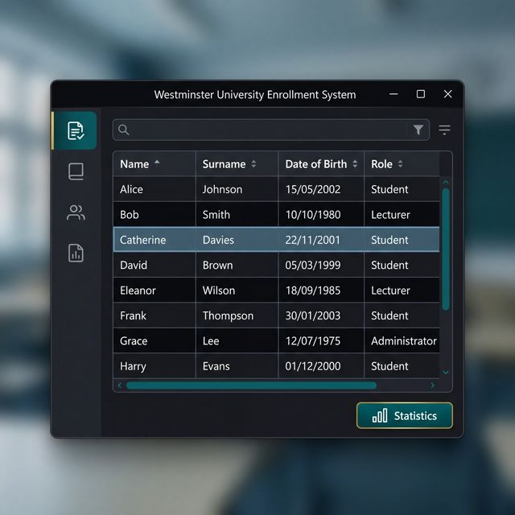

# 🎓 Westminster University Enrollment System

A robust, enterprise-grade academic management system designed to handle complex enrollment workflows for students, lecturers, and support staff. Built with clean **Java 17** architecture and a focus on **Object-Oriented Design Patterns**.

## 🚀 Overview

This project implements a dual-interface management system (CLI + GUI) for university enrollment. It demonstrates high-level competency in Java core concepts, including inheritance, interface-driven design, and custom Swing components.

---

## 🎥 Demo


*Above: A conceptual preview of the integrated Swing GUI with dynamic data binding.*

---

## 🎯 The Problem It Solves

Managing university populations requires more than just a list of names. This system addresses the need for:
- **Heterogeneous Data Support:** Handling multiple person types (Student, Lecturer, Staff) with specific attributes.
- **Strict Data Validation:** Ensuring date formats (ISO-standardized) and unique identifiers.
- **Visual & Terminal Flexibility:** Providing a fast console interface for bulk entry and a GUI for sorted visual analysis.

---

## ✨ Key Features

- **Inheritance-Driven Architecture:** Utilizes a `Person` base class with specialized `Student`, `Lecturer`, and `SupportStaff` implementations.
- **Dynamic Enrollment Management:** Add, modify, and list members with a hard-coded system capacity (configurable).
- **Custom `TableModel` Integration:** A tailored `UniversityTableModel` extending `AbstractTableModel` for seamless data-GUI synchronization.
- **Advanced JTable Functionality:** Includes auto-sorting, custom column naming, and integrated statistics calculations.
- **Persistent Logic:** Built-in hooks for saving/loading data states (expandable to DB integration).

---

## 🏗️ Architecture Overview

The system follows a clean **Controller-Service-Model** approach:
- **`EnrollmentManager` (Interface):** Defines the contract for all enrollment operations.
- **`WestminsterEnrollmentManager` (Service):** The core implementation handling business logic and console interaction.
- **`UniversityTableGUI` (View):** A Swing-based visual layer.
- **`UniversityTableModel` (Data Adapter):** Bridges the `ArrayList<Person>` data source with the `JTable` view.

---

## 🛠️ Tech Stack

- **Core:** Java 17
- **Build System:** Maven
- **GUI Framework:** Swing (Desktop)
- **Data Collections:** ArrayList (with Interface-based typing)

---

## ⚙️ Setup Instructions

### Prerequisites
- JDK 17 or higher
- Apache Maven

### Installation
1. Clone the repository:
   ```bash
   git clone [REPLACEME_REPO_LINK]
   cd UniversityEnrollmentSystem
   ```
2. Build the project:
   ```bash
   mvn clean compile
   ```
3. Run the application:
   ```bash
   mvn exec:java
   ```

---

## 📖 Usage

1. **Console Menu:** Upon launch, follow the terminal prompts to add students or lecturers.
2. **GUI Access:** Press `3` in the console menu to launch the visual table interface.
3. **Sorting:** Click on column headers in the GUI to sort by Name, Surname, or Role.

---

## 📈 Future Improvements

- [ ] **Database Integration:** Move from in-memory ArrayList to PostgreSQL for persistent scaling.
- [ ] **PDF Report Generation:** Export enrollment lists to formatted PDF documents.
- [ ] **Auth Layer:** Add role-based access control (Admin/Staff) for modification actions.

---

## 👤 Author

**Binada Matara Arachchige**
*Computer Science Undergraduate*
[GitHub](https://github.com/binadacode) | [LinkedIn](https://linkedin.com/in/binada)
